## What it is

FleetView is a single browser page that shows every Claude Code session running on your computer today, and tells you which of them have asked you something and are waiting on your answer.

Each of your folders is a small dot, called a hub: your second brain, your CRM, the folder where you write your posts (if you have one), and any other folder you name when you install. Every session hangs off the folder it runs in. A folder appears once it has a session today. Sessions from folders you did not name hang off a hub called **Other**.

This is piece 2 of 4 in the agent workspace. Install them in order: 1 agent-flow, 2 FleetView, 3 ProjectForge, 4 Jeeves. Each one also works on its own.

### Words used in this guide

| Word | What it means here |
|---|---|
| Session | 1 conversation with Claude Code, running in 1 terminal window. |
| Terminal | The text window where you type commands. On a Mac the app is called Terminal: press Command and Space together, type `Terminal`, press Return. |
| Token | The unit Claude's usage is counted in. 1 token is roughly 3 quarters of a word. |
| M, B | Million and billion. 41.3M tokens means 41.3 million tokens. |
| Context window | How much text a session can keep in view at once: 200,000 tokens usually, 1,000,000 on some models. |
| Model | Which Claude model answers: Opus, Sonnet, Fable, Mythos or Haiku. All 5 are Claude models made by Anthropic. |
| Subagent (helper agent) | A second Claude that your session starts to do 1 job and report back, such as finding notes. FleetView's page calls them helpers. |
| Hook | A command Claude Code runs by itself every time a given event happens, such as a tool about to run. Hooks are listed in `settings.json`, Claude Code's settings file. FleetView uses none. |
| Log file | The file where Claude Code writes down every message of a session as it happens. FleetView reads these. |
| 127.0.0.1 and localhost | 2 ways of writing "this computer". An address that starts with either of them opens only on your own computer. |
| Port | The number after the colon in an address such as http://localhost:3010. It picks out which program on your computer answers. In this set of 4: agent-flow 3001, FleetView 3010, ProjectForge 3020, Jeeves 4040. |
| `~` | Short for your home folder. `~/.claude/projects` is the folder `.claude/projects` inside it. |
| Node.js and npm | Node.js is free software that runs FleetView's server. npm is the tool that comes with it and downloads code packages. |
| GitHub, repo, stars | GitHub is the website where the code is kept. A repo is a project's folder of code, kept on GitHub; Git's clone command copies it to your computer (the full line is under Install it). Stars are GitHub's count of people who bookmarked a project. |
| Git branch | The named version of the code a session is working on. It only shows for folders that use Git. |

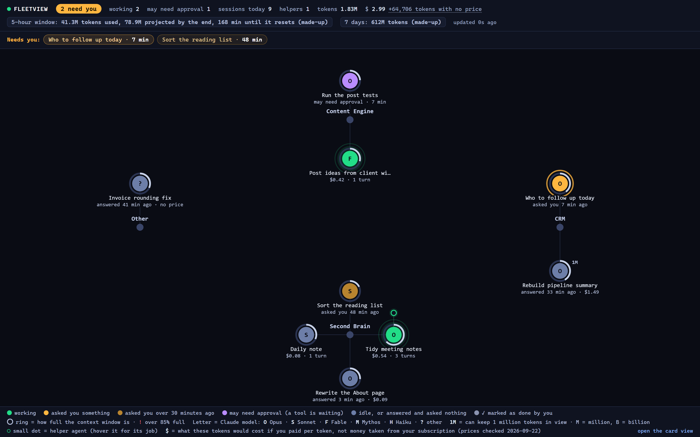

What each part of the picture means:

- **The circle's colour** is what the session is doing:
  - **Green: working.** Claude is doing something right now.
  - **Amber: it asked you something.** Claude's last message ends in a question (a question mark at the end of any of its last 3 lines) and nobody has answered it. This is the one colour that means "go and type".
  - **Darker amber: it asked you over 30 minutes ago.** Still a question for you, but an older one, so it is dimmer than the question you were asked 2 minutes ago.
  - **Violet: it may need your approval.** Claude asked to run a tool and nothing has come back for over 30 seconds. That is either Claude Code asking your permission in that terminal, or a long command such as `npm install`. It is counted on its own, not as "need you".
  - **Blue-grey: nothing for you to do.** Either idle, or Claude answered and asked nothing. The line under the circle says which.
  - **Grey with a white tick: you pressed Mark as done.**
- **"2 need you"** at the top left counts only the amber sessions: the ones that asked you something. A session that answered and asked nothing is never counted, which is why the number stays small enough to act on. A question stops counting after the number of hours set by `waiting_hours` in FleetView's settings file `config.json` (1 hour unless you change it), and the session goes blue-grey.
- The **Needs you** strip under it names those sessions, **newest question first**, with how long each has waited. Click a name to open that session. The strip wraps onto more rows as it needs them and never takes more than about 15% of the screen height.
- **The letter inside** is the Claude model the session uses. Anthropic names its models Opus, Sonnet, Fable, Mythos and Haiku: O Opus, S Sonnet, F Fable, M Mythos, H Haiku, and ? for any other model.
- **The ring round the circle** shows how full the session's context window is. The ring is always the same light grey. Over 85% full, a small red **!** appears beside the circle. Colour is kept for what the session is doing, so a full context window and a waiting question never show as the same colour. A small **1M** tag means the session has a 1,000,000-token window instead of the usual 200,000.
- **Under the circle** is the session's title (Claude Code gives every session a title), then 1 line saying where it stands: "asked you 4 min ago", "may need approval · 3 min", "answered 12 min ago · $0.09", or its cost and number of turns. A turn is 1 reply from the model.
- **Small dots beside a circle** are helper agents (subagents) the session started in the last 30 minutes. Hover a dot to read what that helper is doing.
- **The top bar** adds up every session today, whether or not it is drawn: how many need you, how many are working, how many may need approval, sessions, helpers, tokens and cost. Then your **5-hour window**: a Claude subscription limits how much you can use in each 5-hour period, and this shows the tokens used so far in the current period, where you will end up at this rate, and the minutes until it resets. Then your **7-day total**: tokens used in the last 7 days, which Claude also limits. When idle sessions are left off the drawing, the top bar says how many and offers **show all**.
- **The key** along the bottom explains every colour, letter and mark.

Hover over any circle and a label says, in words, what it is doing.

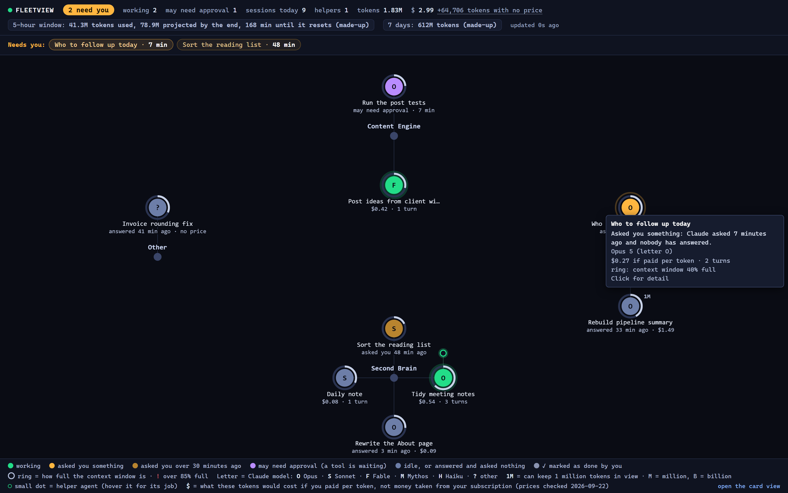

Click any circle and a side panel opens with the full detail and the last 10 entries in the session's log. Each entry is labelled **you typed** (your message), **Claude thinking** (the start of what Claude wrote back) or **Claude used** (a file it read or a command it ran). For a session that asked you something, the panel has a **Mark as done** button: press it when you have dealt with that question another way, so it stops counting. Press Escape to close the panel.


> **Note:** The dollar figures are what those tokens would cost if you paid per token. They are not money taken from your subscription. If you are on a Claude subscription (Pro or Max) you do not pay them. The page says this once, in its key.

There is also a card view at `http://localhost:3010/cards.html` (3010 is the port), with the same sessions, the same totals and the same colours as cards. It works with no internet.

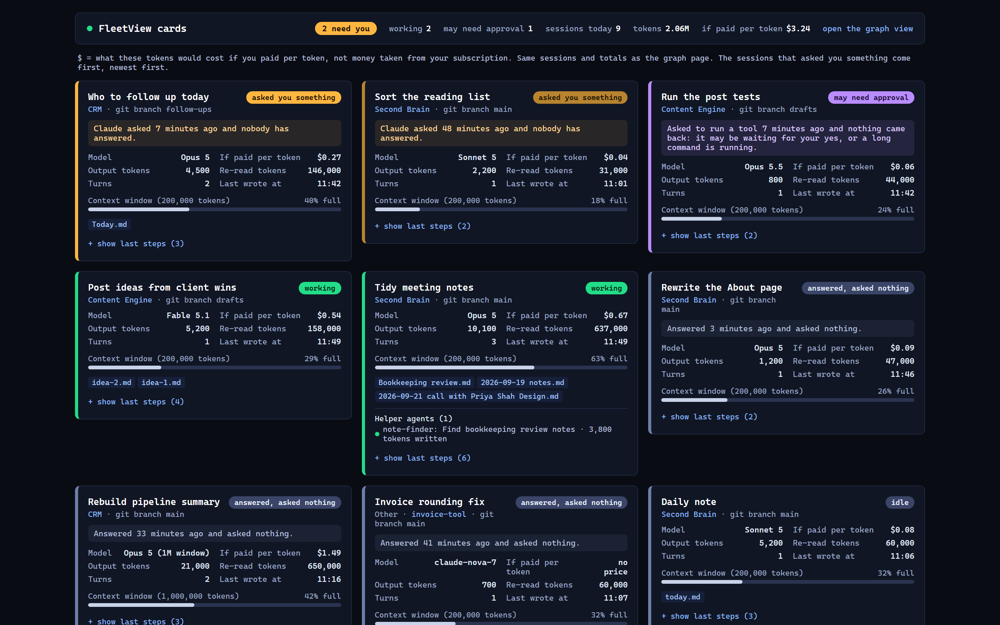

## Why you would want it

Once you run agents, you run several at once. You might have a second brain session tidying notes, a CRM session working out who to follow up and a session drafting posts, each in its own terminal window.

Without FleetView you find out what each is doing by clicking from 1 Terminal to the next. You miss the session that finished 20 minutes ago and has been waiting for your answer since. You do not see that a session's context window is 90% full and about to lose track of the start of the conversation. And on a subscription you need to know how close you are to your 5-hour limit, which Claude Code does not show you in a single place.

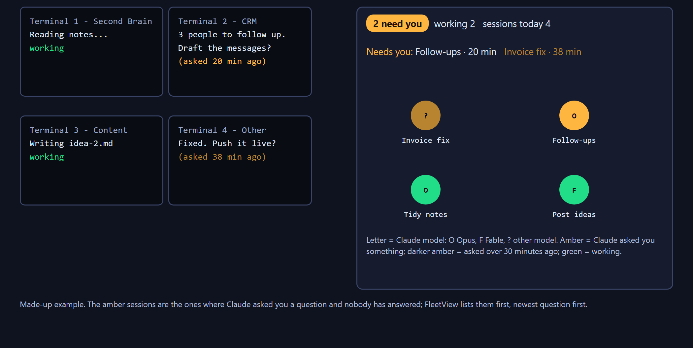

FleetView answers 3 questions:

1. Which session is waiting for me, and for how long?
2. What is running right now, and in which folder?
3. How much of my 5-hour usage window have I used, and where will I end up?

It only reads the log files Claude Code already writes for every session, in the folder `~/.claude/projects` (the folder `.claude/projects` inside your home folder). It adds no hooks and changes no settings.

### What it is for

Seeing every Claude Code session on your computer today on 1 screen, which of them asked you a question, and how much of your 5-hour usage allowance is gone.

### Works well when

- **You run 3 or more sessions at once**, each in its own terminal window, and you keep losing track of which one is waiting for you.
- **You are on a Claude subscription** and want to know how close you are to the 5-hour limit before you start a long job.
- **You want to catch a full context window early.** A red **!** beside a session means its context window, the text it can keep in view at once, is over 85% full: your cue to finish or restart it before it starts forgetting the beginning of the conversation.
- You came back after an hour away and want to know what moved, in which folder, without clicking through 6 terminals.

### Does not work well when

- **You read the dollar figures as money.** They are the pay-per-token prices for the tokens used. On a Claude subscription no such money leaves your account. Read them as a rough measure of how much work a session did, not as money.
- **You use a model FleetView does not price.** It carries Anthropic's own published price list only. A model with no line of its own in FleetView's price table is flagged on screen rather than guessed, and you add its prices yourself in the file `lib/prices.json`.
- **You expect "needs you" to mean "finished".** It means Claude's last message ended in a question. A session grinding through a 40-minute job in silence is not counted at all, so a long quiet job looks the same as a job that finished and asked nothing.
- FleetView cannot tell you whether the work is any good. It reports who is running and who is waiting: it checks whether Claude's last message ends in a question, never whether the answer is right.
- **You are screen-sharing.** The side panel shows folder paths, file names and the start of what you typed. Set `hide_paths` to `true` in FleetView's settings file `config.json`, then run `python3 install.py --stop` and `python3 install.py --start`, before you share: the change only takes effect after that restart.

## How we built it

Everything below comes from Ashley's own records. The times on 2026-06-12 are the times of the screenshots saved that day.

### 2026-06-12, afternoon: the single-tab tool that could not merge

That day Ashley installed agent-flow (piece 1 of 4), an open-source tool that draws a live picture of 1 Claude Code session per browser tab, at http://localhost:3001. He wanted all his sessions in a single tab. Claude wrote a change to merge them. The data came through correctly, but agent-flow's drawing code can only put 1 session at the centre of each picture, so the merged sessions piled on top of each other. The change was taken back out. Ashley's verdict: *"that hasn't worked - It's not working at all."*

### The search for a single-screen tool

Claude then tried the other open-source dashboards for Claude Code:

- **Claude-Code-Agent-Monitor** (456 stars at the time) was ruled out first. On its first start it rewrote the hooks in Claude Code's own settings file, `~/.claude/settings.json`, without asking. Then it tried to import Ashley's entire session history, the log files Claude Code had written, 9.4 gigabytes of them across 3,842 files. That used about 10 processor cores and crashed its own web server. It was stopped and its hooks were removed.
- **claude-view** was ruled out because it runs on macOS only, and Ashley works on a PC. It would run on your Mac, but this guide does not cover it. 2 other tools were ruled out because they needed Docker (a tool for running programs in a sealed box) or Bash (the Mac and Linux command line), which are awkward on his PC.
- **claude-code-dashboard**, by the GitHub user Stargx, was picked because it needs no hooks. It reads the log files in `~/.claude/projects` directly, so every folder on the computer is covered with no set-up. Its card view, unchanged, was running by 16:56.

What was kept from it: the code that watches the log files and reads new lines as they arrive, the first version of the working, waiting and idle rules, and the card page. Its port was changed from 3001 to 3010, because agent-flow already used 3001. (Its instructions file said you could choose the port with a setting called `PORT`; the code ignored that setting.)

### 2026-06-12, evening: the graph

A second search of GitHub found nothing that draws all live sessions as a single graph on his PC. The nearest tools either looked back at sessions after the fact or showed 1 project only. So Claude added a new address on the server, `/api/graph`, that hands the page its data, and a new page, `graph.html`, written from scratch with no borrowed code. It shows today's sessions, helper agents active in the last 30 minutes and each session's last 10 log lines, and trims idle sessions to the 3 most recent per folder. The first version was on screen at 18:55.

![Ashley's first FleetView graph, 2026-06-12 18:55. His real folders, his CRM (a folder named Nexus) and his second brain, with 9 sessions. This first version named each session after its Git branch, the named version of the code it was working on, which is why most of them read "master"; the figures beside each one are the cost if paid per token, then the number of turns (426t means 426 turns). "Subagents live 2" means 2 helper agents were running. The top bar had no token counts yet. (Ashley's own PC, not a Mac)](img/history-2026-06-12-first-graph.png)

Later that evening:

- **The price table was corrected.** The original table priced Opus 4.6 at $15 per million tokens sent to the model (input) and $75 per million tokens it wrote back (output), and priced text saved for Claude to re-read later at a quarter of the price of text sent to the model. The Opus prices and the price for saved text were both wrong. The table also had no rows for Fable or Opus 4.8, so it priced them at Sonnet rates, below their real rates. The fix that evening added prices for both.
- **22:25, token counts.** Ashley is on a subscription, so tokens matter more than dollars. The top bar gained a total token count and an output token count.
- **22:34, the 5-hour window.** Ashley asked for his usage limit to be shown: *"fix it"*. A new address on the server, `/api/usage`, runs ccusage, a free open-source tool that works out Claude's 5-hour usage periods from the same log files. It shows the tokens used so far in the current 5-hour period, the tokens you are on course to use by the end of it, and the minutes until the period resets.


- **22:45 to 23:06, budgets and alarms.** Ashley asked for all of it to be built: *"make all this so"*. A 7-day total was added. You could now click either gauge and type your own budget into it: green while the projected total is under 70% of your budget, amber from 70% to 90%, red at 90% and over. Your browser shows 1 notice when the 5-hour window is on course to pass the budget you typed in. Anthropic does not publish the exact token limit for each plan, so FleetView does not guess one; Ashley typed in his own figure.


### The same evening: the other views on the same server

The same evening Claude also added a map of all 73 of Ashley's agents, called FleetMap, and a view of agents passing work between his apps, called Comms Mesh. A small file on his PC started the server by itself, with no window, each time Ashley switched on his computer and signed in. On 2026-07-02 a 3D video view, Fleet Cinema, was added to the same server; its Vault Galaxy view draws every note in his second brain as a star. None of these are in your download: they were built around Ashley's own agents and apps. They are shown here as Ashley built them.

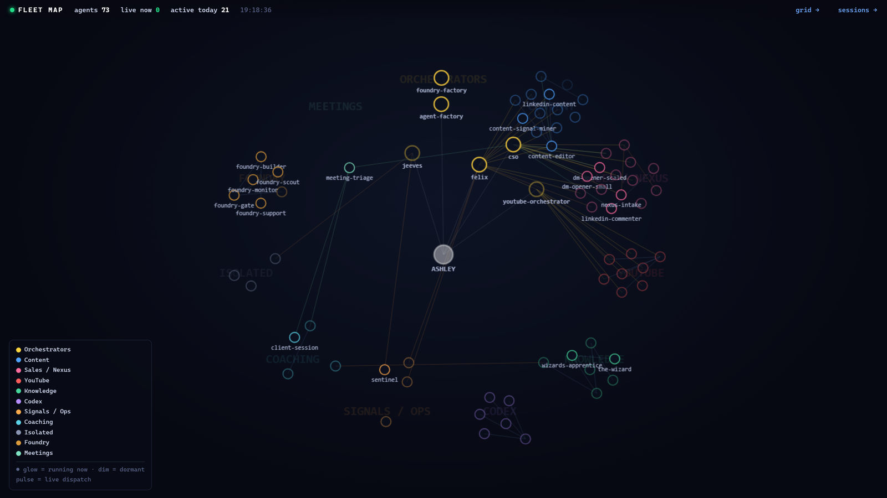


### 2026-06-21: the ruling against separate dashboards

9 days later Ashley ruled against building any more separate dashboards. On a page that streamed events as they happened: *"I hate seeing a stream of info - It just means nothing."* On a second standalone dashboard: *"I'd rather have this as part of Project Forge frankly."* ProjectForge is his work board. He ruled that views of the agents belong as a tab inside the work board, never as another program on another port.

### 2026-07-27 to 2026-09-22: it stopped running

- **2026-07-27:** Ashley's list of outside tools he tracks moved the Stargx dashboard from "give to members" to "keep an eye on": 10 stars, no change since 2026-03-09, "fine for us because we can fix it", but too thin to put in front of the 6 people paying for his Outliers programme at the time.
- **2026-08-12:** the last day Ashley's own notes show FleetView running.
- **2026-09-22:** nothing answered on port 3010, although the file that started it each time his PC started was still there. Why it stopped starting by itself is not recorded. A copy started by hand from a temporary folder came up in about 2 seconds.

![Ashley's real FleetView on 2026-09-22, from that copy: 7 sessions round 4 of his folders: Nexus (his CRM), The Observatory (a research folder), SB and Second Brain (2 second-brain folders); the 5-hour window at 340.84M tokens used, 374.00M projected by the end, 26 minutes until it resets; 3.44B tokens (3.44 billion) over the last 7 days. In this old copy the ring around each circle used blue, amber and red, the same colours the circle itself uses for what the session is doing, so the 2 ran together. Your copy uses a plain grey ring. (Ashley's own PC, not a Mac)](img/original-fleetview-2026-09-22.png)

### 2026-09-22: making it fit for you

For this download we took Stargx's dashboard plus 3 of Ashley's additions (the graph page, the 5-hour and 7-day panel, and the corrected prices), and fixed what we found wrong on the day. It was checked 3 ways before you got it: a run-through of this guide by a tester who had never seen it, following only the words on the page, a usability review of the pages, and a security review of the code. What they found is fixed:

- **Amber vanished after 15 seconds, and the first fix then left 18 of 30 sessions amber.** The original kept a session amber for 15 seconds after Claude answered, then turned it blue, so a session that asked you a question 4 minutes ago looked the same as a session nobody had touched since breakfast. (Claude Code writes a few bookkeeping lines to its log after each reply, and those were resetting the colour.) The first fix went the other way: every finished reply counted, so on a 30-session day 18 circles were amber and the colour told you nothing. The rule you have is the narrow one: a session is amber only when Claude's last message asked you something. "Done, saved." is not a question, so that session sits quietly in blue-grey and says "answered 12 min ago".
- **The 7-day figure counted other AI tools.** ccusage adds up every AI coding tool it finds on your computer unless it is asked for Claude only. Yours asks for Claude Code only (`ccusage claude`, checked with ccusage 20.0.24 on 2026-09-22).
- **The totals disagreed.** The graph added up only the sessions it drew, and the card page hid others. Both pages now show the same totals for every session today, and say when some are not drawn.
- **A stopped FleetView still looked alive.** If FleetView stopped, the page froze and kept a session pulsing green. Yours shows a red **FleetView stopped** banner within 5 seconds, and every "12 min ago" on the page stops counting up with it.
- **The original showed nothing if you installed it before you had ever used Claude Code, and only woke up when you restarted it.** Yours starts reading the log folder as soon as Claude Code creates it.
- Ashley's copy grouped sessions by the folder name after the Documents folder in its path, which only fits his habits. Yours groups by the folders you name when you install.
- His copy had no price for Opus 5, the model every session used that day, so it priced them at Sonnet 4.6 rates. Prices now come from a table checked on 2026-09-22 against Anthropic's pricing page, and a model with no price row shows "no price" instead of a guess.
- His copy assumed every session had a 200,000-token context window. A session on a 1,000,000-token window showed 100% full. FleetView now switches to 1,000,000 when the model name ends in `[1m]` (the label Claude Code adds to a model running with the 1,000,000-token window) or a single turn uses more than 200,000 tokens.
- A Haiku helper agent inside an Opus session was priced as Opus, and the helper's replies were counted into the main session's ring, so the ring read wrong. Each reply is now priced with its own model, and the ring counts only the main conversation.
- The original let any computer on your network open the page, so anyone on the same wifi could read your session titles and folder paths. Yours only answers on this computer, and it checks the address each request was sent to, refusing any request not sent to `localhost` or `127.0.0.1`. That stops a website you visit from pointing its own name at your computer to read your session titles, folder paths and what you typed.
- His copy ran ccusage every 60 seconds all day. Yours runs it only while a FleetView page is open.
- The card page loaded its drawing library, React, from the internet. Yours carries a copy, so it works offline.

## Pros and cons

| | Pros | Cons |
|---|---|---|
| Set-up | Reads files Claude Code already writes. It adds no hooks (commands Claude Code would run by itself), changes no settings and keeps no database. Deleting the folder removes it completely. | Needs Node.js (free software that runs FleetView's server) version 22 or newer, and Python 3.11 or newer, which you may not have. |
| Cost in tokens | Uses 0 Claude tokens. It is plain code reading files. | None. |
| Cost in time | About 5 minutes to install. Starts in seconds: Ashley's log files, 3.2 gigabytes of them when we checked on 2026-09-22, were read and drawn in about 2 seconds. | The first read of a very large history takes longer and uses some processor time. |
| What it shows | Every session in a single tab, including sessions started before FleetView, with the waiting ones first. The 5-hour gauge shows how much of your 5-hour allowance you have used and where you will end up at this rate. | On 2026-06-21 Ashley ruled against a page that listed every agent event in a long running list as it happened: "I hate seeing a stream of info - It just means nothing." |
| Waiting | Amber stays until you answer, and the Needs you strip says how long each has waited. | A session counts as waiting whenever Claude's last message ends in a question, including questions you have already dealt with another way. Press Mark as done on those. |
| Accuracy | Prices checked on 2026-09-22; unknown models are flagged, not guessed. | Prices go out of date with every new model, and you must add each new model's prices to `lib/prices.json` yourself. The context window is a best estimate (see When it goes wrong). |
| Upkeep | Small: 1 server file and 2 pages. Your own Claude can change it in minutes. | The free project it is built on, Stargx's claude-code-dashboard, is barely maintained: 13 people have bookmarked it on GitHub and nobody has changed the code since 2026-03-09 (checked 2026-09-22). If it breaks, you and your own Claude fix it. |
| Privacy | Only reachable from your own computer. | The side panel shows folder paths, file names and the start of what you typed. Careful when screen-sharing: set `hide_paths` to `true` in `config.json` (see Every command and setting). |

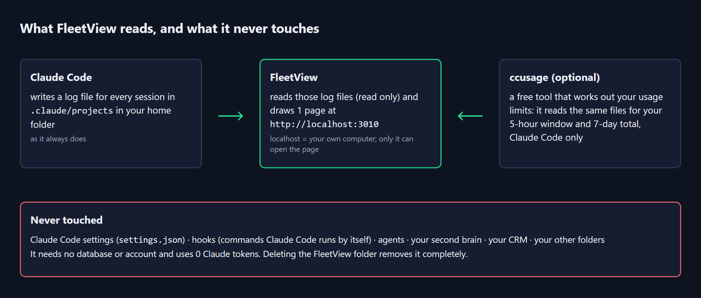

### The free ready-made alternative

If you would rather have a bigger, polished tool that someone else maintains, look at **Claude-Code-Agent-Monitor** (https://github.com/hoangsonww/Claude-Code-Agent-Monitor, MIT licence: free to use and change, as long as the credit stays). On 2026-09-22 it had 1,012 stars and a change the day before. It is a full app you open at http://localhost:4820, with a database, charts of how your agents work, a desktop app for PCs and Macs that sits beside the clock, and an interface you can read in 5 languages.

> **Warning:** Its set-up (`npm run setup`, then `npm run install-hooks`) adds its own hooks to `~/.claude/settings.json`, and its desktop app installs those hooks on first start. It also imports your whole session history when it first starts. On Ashley's computer on 2026-06-12 that import used about 10 processor cores and crashed it. Before you try it, copy `~/.claude/settings.json` somewhere safe, and expect 1 extra program to start every time Claude Code reaches one of its hooks, which is on every tool it uses and every reply it writes.

## Before you start

### Before you start on a Mac

**Python.** Install Python from https://www.python.org/downloads/macos/ (the link labelled "macOS installer"; we tested 3.14.7). When it finishes, double-click **Install Certificates.command** and **Update Shell Profile.command** in the Python folder inside Applications, then open a new Terminal window. Check with `python3 -c "import sys; print(sys.prefix)"`: it should print a line starting `/Library/Frameworks/Python.framework`. If it starts `/opt/homebrew` or `/usr/local/Cellar`, your Terminal uses Homebrew's Python (Homebrew is an add-on installer many Mac owners use). Every command here still works. The self-checks run from a private Python folder: a folder in your home folder with its own copy of Python's add-ons, which works with python.org's Python and with Homebrew's.

**Node.js.** Install the LTS version (long-term support: the version that gets security fixes the longest) from https://nodejs.org (we tested v24.21.0), open a new Terminal window, and check with `node --version`: `v22` or higher.

**The first time you type `git`.** Your Mac may show a box asking to install the command line developer tools. Press Install, wait until it has finished, then type the `git` line again.

**If Terminal says `claude` is not found,** type the line below. It adds the folder Claude Code is installed in to the list of folders Terminal looks in for programs. Then open a new Terminal window and check with `claude --version`.

```
echo 'export PATH="$HOME/.local/bin:$PATH"' >> ~/.zshrc
```

**Your second brain** is at `~/Second Brain` on a Mac, a folder in your home folder, not in Documents, because macOS can stop a program that starts by itself from opening your Documents folder. If a page says "macOS refused access to" a folder, move that folder into your home folder and run `python3 install.py` again.

**"Allow Node.js to find devices on local networks?"** If macOS asks this the first time the page opens, press Allow.

**Apple Silicon or Intel** (the 2 kinds of chip a Mac can have; the Apple menu, then About This Mac, shows yours): the steps are the same on both, and both were tested.

**Tried only on test Macs.** Every step above was tried only on test Macs (Macs GitHub rents out by the minute to run scripts, not a person's own Mac), never on a real Mac. 3 of them cannot happen on a test Mac, so they were not tried at all: the developer-tools box, macOS stopping a program from opening Documents, and the question about devices on local networks.

| You need | How to check | How to get it |
|---|---|---|
| Node.js 22 or newer | Open Terminal and type `node --version`. You should see v22 or higher. Node 18 stopped getting security fixes on 2025-04-30 and Node 20 on 2026-04-30, so the installer refuses anything older. | The LTS installer (LTS means long-term support, the version that goes on getting security fixes longest) from https://nodejs.org. Then open a new Terminal window. |
| Python 3.11 or newer | `python3 --version`. Python 3.10 gets security fixes only until 2026-10-31 and older versions get none, so the installer refuses 3.10 and older. | https://www.python.org/downloads/macos/ (see Python above). |
| Git (the tool that copies the code from GitHub to your computer) | `git --version` | It comes with your Mac's command line developer tools (see The first time you type `git`, above). |
| Claude Code, used at least once | Type `ls ~/.claude/projects`: it lists 1 folder per project once you have used Claude Code | You have this from the earlier sessions. If not, FleetView still installs and starts reading the folder as soon as it appears. |
| Internet | Open any web page in your browser. If it loads, you have what FleetView needs | Needed for the install and for the first run of the 5-hour gauge (it downloads ccusage). The pages themselves need nothing from the internet. |

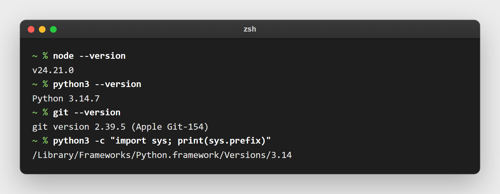

## Install it

1. Open Terminal: press Command and Space together, type `Terminal`, press Return. It opens in your home folder, which is where all 4 downloads in this set go.
2. Copy the program to your computer and start the installer, typing 1 line at a time:

```
git clone https://github.com/OUTLIERS-ai/outliers-ws-02-fleetview-mac
cd outliers-ws-02-fleetview-mac
python3 install.py
```

3. The installer checks Python and Node.js. If Python is older than 3.11, or Node.js is missing or older than 22, it tells you how to get it and stops without changing anything.
4. It downloads 2 small add-on code packages FleetView needs, using npm (the download tool that comes with Node.js). This needs internet and takes under a minute.
5. It asks where your **second brain folder** is, then your **CRM folder**. (If you keep them in Obsidian, the note-taking app, these are what Obsidian calls vaults.) It looks in your home folder, then your Documents folder and suggests the likeliest folder in brackets. Press Return to accept, type a different path, or type `-` to skip.
6. It asks for **any other project folders**, 1 at a time. If you keep a folder where you write your posts, add it here and give it a short name such as `Content Engine`. Press Return on an empty line to finish.
7. It asks for the **port**: the number at the end of the page's address (3010 gives http://localhost:3010). Press Return for 3010, unless something else on your computer already uses 3010.
8. It asks whether to switch on the **5-hour and 7-day token panel**. Say yes unless you have no internet.
9. It asks whether FleetView should **start by itself, with no window, each time you switch on your Mac and sign in**. Saying yes writes a LaunchAgent: a small file, `~/Library/LaunchAgents/com.outliers.fleetview.plist`, that tells your Mac to start FleetView each time you sign in. It takes effect the next time you switch on your Mac and sign in; the installer also prints a `launchctl load -w` line "to start it now, without signing out and in again", which you do not need, because the next question starts FleetView now.
10. It asks whether to **start FleetView now**, with no window. Say yes.
11. Open **http://localhost:3010/graph.html** in your browser. (`http://localhost:3010/` takes you there too.)


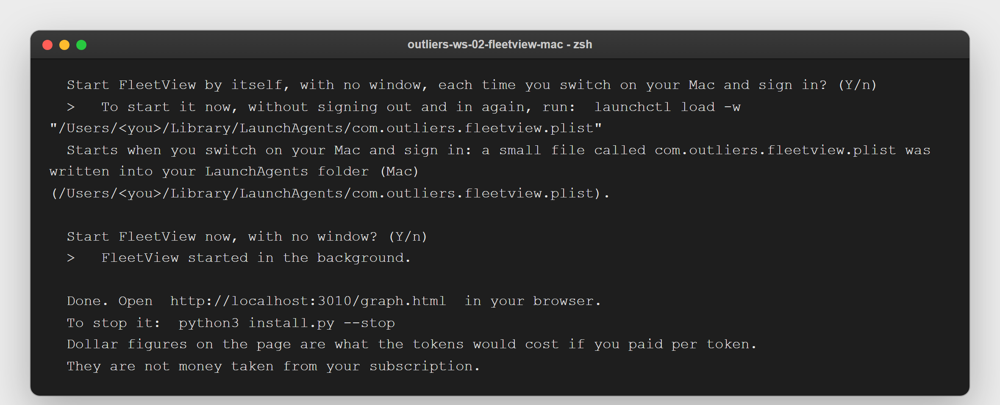

When it has worked you see your folders as hubs with today's sessions hanging off them, like the picture at the start of this guide. If you have no Claude Code session today, the page says so; start a session and it appears within 2 seconds.

> **Note:** The 5-hour gauge says "first check" for up to a minute the first time, while your computer downloads ccusage. After that it updates about once a minute while the page is open, and the 7-day total about every 5 minutes.

Running the installer again with the same answers changes nothing, and if FleetView is running it says so. If you change an answer, it saves your old settings as `config.json.bak-<date and time>` first (for example `config.json.bak-20260924-110312`), stops the running FleetView and starts it again on the new settings, so there is never more than 1 copy running.

These commands run inside the FleetView folder. In a new terminal, type `cd outliers-ws-02-fleetview-mac` first.

- To stop FleetView: `python3 install.py --stop`. This finds it however it was started, including when it started by itself when you switched on your Mac and signed in.
- To start it again: `python3 install.py --start`. This only starts it, with your saved answers. It asks no questions.
- To stop it starting by itself when you switch on your Mac and sign in: `python3 install.py --uninstall`. This stops FleetView, switches off the LaunchAgent it made and removes it.
- To remove it completely: uninstall, then delete the folder.

> **Tip:** Want to see FleetView working before your own sessions exist? In a new terminal, type `cd outliers-ws-02-fleetview-mac`, then `npm run demo`, then open http://localhost:3011/graph.html. It draws 8 made-up sessions in 4 folders (1 of them the Other hub) on port 3011, so it never clashes with your own copy on 3010. Press Ctrl+C to stop it.

## Using it day to day

- **Leave the tab open.** Pin `http://localhost:3010/graph.html` in your browser. It refreshes itself every 2 seconds, and "updated 0s ago" at the top tells you it is alive.
- **Look at the Needs you strip first.** It names every session that asked you something, newest question first, and wraps onto more rows when there are more of them. Click a name to open it, then switch to that terminal and answer.


- **Dealt with a question another way? Press Mark as done.** Open the session and press **Mark as done**; the circle turns grey, gets a white tick and its line reads "done · was waiting 12 min", so you can see you dealt with it rather than never opened it. The choice is kept in this browser. If Claude writes again in that session, it comes back.
- **"May need approval" is its own colour.** If a session asked to run a tool and nothing has come back for 30 seconds, it turns violet and is counted under **may need approval** in the top bar, not under "need you". Claude Code may be asking your permission in that terminal, or a long command such as `npm install` is running. Check the terminal.
- **Watch for the red !** beside a circle. It means that session's context window is over 85% full. Start a fresh session for the next task, or ask it to summarise and carry on.
- **Set your budgets once.** Click **5-hour window** in the top bar and type a token number, such as `100M` (100 million). Do the same for **7 days**. Allow browser notifications when asked. With no budget the gauge stays grey; with a budget it turns amber at 70% and red at 90% of the projected total, and you get 1 notice when the projection passes your budget. The budgets are saved in this browser only. If FleetView cannot read what you typed, it says so and keeps your old budget.
- **See everything.** The graph draws every working and waiting session, plus the 3 most recent idle ones per folder. When some idle sessions are left out, the top bar says how many and offers **show all**, and each folder hub says "+2 idle not drawn". You can also open http://localhost:3010/graph.html?all=1 to draw every session.
- **Busy days.** As soon as any 1 folder has more than 4 sessions, or you have more than 12 in total, the graph switches to 1 column per folder, with the sessions that asked you something at the top. 30 sessions stay readable on a laptop screen: we checked it in a browser window 1366 pixels wide and 768 pixels tall, and all 58 pieces of writing on the page, the session titles and the lines under them, stayed clear of each other. Each column heading says how many sessions it has and how many need you.

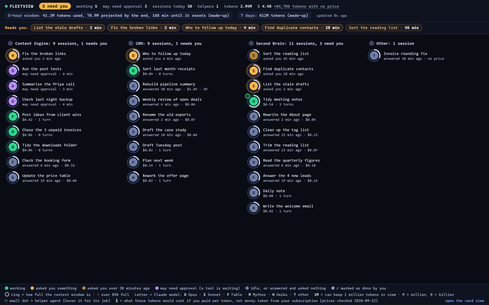

- **2 different totals.** The top-bar tokens and cost add up every session today on this computer. The 5-hour gauge counts your account's current 5-hour window, which can start yesterday evening and includes sessions no longer on screen. When they differ, the 5-hour gauge is the one that matches your usage limit.
- **Tokens that are mostly re-reads.** Most of the token total is usually "re-read context": Claude re-reading text it was already sent, the cheapest kind. Hover over **tokens** to see the share.
- **New model released?** Open `lib/prices.json`, add a row with the rates from https://platform.claude.com/docs/en/about-claude/pricing, then restart FleetView (`python3 install.py --stop`, then `python3 install.py --start`). Until you do, that model shows "no price" and its tokens appear in grey as "tokens with no price", left out of the dollar total. The table you have was read off that page on 2026-09-22, the day Claude Opus 5.5 came out, and it carries Opus 5.5 at $4 per million tokens sent to the model and $20 per million tokens it writes back. `npm test` reads your own logs from the last 7 days and fails if a model in them has no row, so a new model cannot go unpriced without you being told.

## Fit it to your own AI system

**The safe way.** Try every change on a copy of FleetView first, so the FleetView you use every day keeps running while you experiment. 5 steps:

1. Make the copy and give it its own port. Open a new Terminal window (it opens in your home folder) and type these lines, 1 at a time:

```
cp -R outliers-ws-02-fleetview-mac fleetview-test
cd fleetview-test
rm -f fleetview.pid
python3 install.py --yes --port 3012
```

The first line copies the whole folder to a new folder, `fleetview-test`. The third deletes `fleetview.pid`, the record of your everyday FleetView that came across with the copy. The last line writes the copy's settings file, `config.json`, with port 3012 and the same folders, and asks no questions. Never use 3001, 3020 or 4040: the other 3 pieces in this set use them.
2. Change settings in `config.json` the same way, with the installer, rather than by hand. If you do open `config.json` in a text editor, it must stay plain text with straight quotes: TextEdit's Smart Quotes turn `"` into curly quotes, and saving as rich text adds formatting, and either leaves a file FleetView refuses to read. The installer's answers cover the port and every folder.
3. The copy's `fleetview.pid` is already gone: the third line above deleted it. If you ever forget it, the installer sees that the record belongs to another folder and leaves your everyday FleetView alone.
4. Start the copy, in the same Terminal window, with `python3 install.py --start`, and open http://localhost:3012/graph.html. In that folder, `python3 install.py --stop` stops the copy only.
5. Before you copy a change back, check it in the copy, still in the `fleetview-test` folder. FleetView has 2 sets of checks, and a change should pass both. `npm test` runs FleetView's own 60 checks; near the end, look for `pass 60` and `fail 0`. The installer's 30 checks run with pytest, a free Python testing tool, from the private Python folder described in Before you start on a Mac. Make that folder and install pytest into it once, from any folder:

```
python3 -m venv ~/outliers-checks
source ~/outliers-checks/bin/activate && python -m pip install pytest
```

The part before `&&` switches this Terminal window into the private folder, so the `python` after it is the folder's own copy. Then run both sets of checks, still in `fleetview-test`:

```
npm test
source ~/outliers-checks/bin/activate && python -m pytest -q
```

The second should end with "27 passed, 3 skipped": the 3 skipped checks look at a file only a PC uses to start FleetView, so a Mac skips them. If a check fails and its message says a model name is in your logs with no row in `lib/prices.json`, Claude has released a model FleetView has no price for: add it to `lib/prices.json` (see Using it day to day). Any other failure means the change broke something, so put it back before you go on.

When the checks pass, make the same change in your everyday `outliers-ws-02-fleetview-mac` folder and restart FleetView there: in the terminal, type `cd ../outliers-ws-02-fleetview-mac`, then `python3 install.py --stop`, then `python3 install.py --start`.

The copy reads the same Claude Code log files as your everyday FleetView. Both only read them, so neither gets in the other's way.


Read "Every command and setting" near the end of this guide before you ask Claude for a change, because much of what you want is already a setting in `config.json`. The setting to leave alone is `host`: `127.0.0.1` means only this computer can open the page. Put your computer's network address there instead and every other computer on the same wifi can open the page and read your sessions, what you typed and your usage.

Change it until it matches how you work. FleetView did not start as Ashley's: it started as somebody else's free dashboard, published with its code open to read, that showed 1 card per session and nothing more. Ashley moved it off port 3001 so it would stop clashing with agent-flow, replaced its price table after finding 2 models charged at Sonnet's cheaper rates instead of their own, and then had Claude write the graph page you are looking at from scratch, in plain code with no libraries. That same evening he had Claude add the 5-hour and 7-day usage gauges, budget alarms you set by clicking a gauge (green under 70%, amber to 90%, red above, with a browser alert when the projection passes what you set), and a second page that drew all 73 of his agents as a map.

Each change below is a prompt you can paste into Claude Code, opened in your copy, the `fleetview-test` folder: in a new Terminal window, type `cd fleetview-test`, then `claude`. Claude reads the code and makes the change. Then run both sets of checks in the copy, as in The safe way above; every check should pass. To see the change, run `python3 install.py --stop` and then `python3 install.py --start` in the copy, and reload http://localhost:3012/graph.html. When you are happy, paste the same prompt into Claude Code opened in your everyday `outliers-ws-02-fleetview-mac` folder, run both sets of checks there, and restart it with `python3 install.py --stop`, then `python3 install.py --start`.

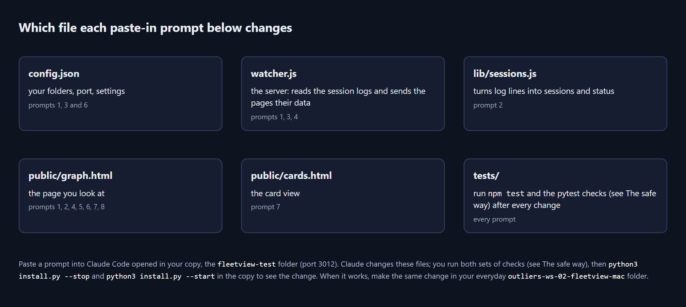

### 1. Put your CRM's today list beside the graph

If your CRM vault writes a daily list of who to contact (in Ashley's it is a page called `Today.md`), this puts it beside your sessions, so you can see whether your CRM agent has made today's list yet.

```
In this FleetView folder, add a collapsible panel on the left of public/graph.html that shows my CRM's Today.md page. Add a "crm_today" path to config.json and config.example.json, add a GET /api/crm-today route in watcher.js that reads that file (read-only, never write to my CRM) and returns its text, and show the first 15 lines in the panel with the file's last-changed time. If the file is missing, show "No Today page yet". Add a test in tests/ using a made-up Today.md.
```

### 2. A plain line per session: what did I ask it?

This adds, under each circle, the last message you typed in that session.

```
In this FleetView folder, change lib/sessions.js to keep the most recent message I typed in each session (type "user", not a subagent), cut to 60 characters, and send it in the /api/graph data as "lastAsk". In public/graph.html, draw it in small grey text under each session's title, and add it to the hover label. Keep the tests passing and add a test for lastAsk.
```

### 3. An alarm that reaches you with the browser closed

Today the budget alarm and the waiting list only work while the page is open.

```
In this FleetView folder, add a server-side check to watcher.js: read "budget_5h_tokens" and "notify_waiting_minutes" from config.json. When the ccusage 5-hour projection passes the budget, or a session has been waiting for longer than notify_waiting_minutes, show a macOS notification once. Only check while the server is running, never on a separate timer or scheduled task. Add the settings to config.example.json and explain them in README.md.
```

### 4. Cost per folder per week

**Where did this week's usage go, folder by folder?** The download cannot tell you. The top bar adds up 1 total for the day, and nothing on the page breaks that total down by folder. This prompt adds it, so you can see which of your folders uses the most: second brain, CRM or any other folder you named.

```
In this FleetView folder, add a GET /api/by-folder route to watcher.js that adds up tokens and cost per folder group for the last 7 days, using the sessions already read and lib/groups.js. Add a small table at the bottom of public/graph.html, opened by clicking "by folder" in the key. Label the dollar column "$ if paid per token". Add a test with the made-up sessions from tools/make-demo.js.
```

### 5. Colour helper agents by what your agents do

Your agents live in `~/.claude/agents` and in your vault's `.claude/agents`. Each file has a description.

```
In this FleetView folder, read every agent file in ~/.claude/agents and in the .claude/agents folder of each folder listed in config.json (read-only). Sort them into up to 6 colour groups using simple keywords from each agent's description (for example: research, writing, CRM, vault upkeep, content, other). Colour each helper-agent dot on public/graph.html by its group and add the groups to the key along the bottom. Do not hard-code any agent names.
```

### 6. Flag sessions that write into a drafts folder

When a session is writing post drafts into a folder you review, you usually want to read them straight after.

```
In this FleetView folder, add a "watch_folders" list to config.json, for example the folder where my post drafts are saved. When a session in /api/graph has touched a file inside one of those folders in the last 30 minutes, add "touchedWatched": true, and draw a small star next to that session on public/graph.html. When the session is then waiting for me, put it first in the Needs you strip with the words "drafts ready". Add a test with made-up sessions.
```

### 7. Hide paths with 1 click for screen-sharing

The `hide_paths` setting hides folder paths, file names and what you typed, but you have to edit a file and restart. This puts it on a button.

```
In this FleetView folder, add a "hide details" button to the key of public/graph.html and public/cards.html. When pressed, the pages hide full folder paths, file names and the text of the recent steps, and show only the folder group name. Remember the choice in the browser's localStorage, wrapped in try/catch. The existing hide_paths setting in config.json should still work and should win when it is true.
```

### 8. Put it where you already look

Ashley's own ruling was that views like this belong inside the page you already work from, not in yet another tab.

```
In this FleetView folder, make public/graph.html work when shown inside another page: add a "compact=1" address option that hides the key, shrinks the top bar to "need you", working, 5h window and 7 days, and fits the graph to a small area. Then tell me the exact address to use, and how to add it to my second brain's home note or my work board as an embedded web page.
```

## Every command and setting

### Commands

| Command | What it does |
|---|---|
| `python3 install.py` | Checks Node.js, downloads 2 code packages, asks for your folders, writes the settings file `config.json`, offers to make FleetView start by itself, with no window, when you switch on your Mac and sign in, then starts FleetView |
| `python3 install.py --start` | Starts FleetView in the background with your saved answers. No questions. Says so if it is already running |
| `python3 install.py --stop` | Stops FleetView, however it was started. It checks it is really FleetView first, so it never ends another program |
| `python3 install.py --uninstall` | Stops FleetView, switches off the LaunchAgent it made and removes it, so it no longer starts by itself when you switch on your Mac and sign in. Leaves your settings and this folder |
| `python3 install.py --yes` | Installs with no questions, using the options below (the words starting with `--`) and the defaults it finds. It does not start FleetView, or write the LaunchAgent that starts it when you switch on your Mac and sign in, unless you add `--start` (start it now) and `--launcher` (write the LaunchAgent) |
| `--second-brain PATH`, `--crm PATH`, `--folder "NAME=PATH"` | Give your folders on the command line (`--folder` can be repeated) |
| `--port 3010`, `--projects-dir PATH`, `--no-ccusage` | Choose the port, a different Claude Code log folder, or switch the token panel off |
| `--launcher` / `--no-launcher`, `--no-start` | Write the LaunchAgent that starts FleetView by itself when you switch on your Mac and sign in, or do not; do not start FleetView now |
| `node watcher.js` or `npm start` | Start FleetView in this terminal, showing any error it hits. Ctrl+C stops it |
| `npm run demo` | Made-up sessions on port 3011 (see the tip in Install it) |
| `node tools/make-demo.js ~/fleetview-busy-day --sessions 30` | Writes a made-up busy day of 30 sessions into the folder you name (here `fleetview-busy-day` in your home folder), to see what a full screen looks like |
| `npm test` | Runs FleetView's own 60 checks against made-up sessions and prints a line per check saying whether it passed |
| `source ~/outliers-checks/bin/activate && python -m pytest -q` | Runs the installer's own 30 checks in a temporary folder, using pytest from your private Python folder (see Fit it to your own AI system). 27 pass and 3 are skipped. 90 checks in total with `npm test` |

### Settings in `config.json`


| Setting | What it does |
|---|---|
| `port` | The page's port, 3010 by default |
| `host` | `127.0.0.1`: only this computer can open the page. Leave it |
| `folders` | Your folders: `[{ "name": "CRM", "path": "..." }]`. A session belongs to the folder whose path matches most closely, so a sub-folder you name wins over its parent |
| `idle_per_folder` | How many idle sessions to draw per folder. It is 3 unless you change it. The totals always count every session, drawn or not |
| `waiting_hours` | How many hours an unanswered question stays amber (1). After that the session turns blue-grey and leaves the Needs you list. Raise it if you want yesterday evening's question still showing this morning |
| `fresh_minutes` | A question asked less than this many minutes ago is drawn in the bright amber; older ones get the darker amber. It is 30 minutes unless you change it |
| `hide_paths` | `true` hides folder paths, file names and the text of the recent steps, for screen-sharing |
| `usage.enabled` | `false` switches the 5-hour and 7-day panel off |
| `usage.package` | The ccusage version FleetView runs (`ccusage@20.0.24`, checked 2026-09-22). Only change this if you mean to |
| `projects_dir` | The folder Claude Code writes its session logs into. Leave it out unless Claude Code keeps its logs somewhere other than `~/.claude/projects` |

After any change, restart FleetView: `python3 install.py --stop`, then `python3 install.py --start`. `config.example.json` shows every setting with an example.

### Files FleetView makes

- `fleetview.pid`: the running FleetView's process number and port, so `--stop` can find it. Removed when it stops.
- `fleetview.log`: what FleetView printed when it was started in the background. If it will not start, the reason is at the end of this file.
- `config.json.bak-<date and time>`, for example `config.json.bak-20260924-110312`: your old settings, saved whenever the installer changed them.

### Advanced: settings from the terminal

`PORT` overrides the port, `FLEETVIEW_CONFIG` points at a different settings file, `CLAUDE_CONFIG_DIR` points at a different Claude Code folder, and `FLEETVIEW_NO_CCUSAGE=1` switches the token panel off. These are environment variables: set a variable for 1 start by typing it before the command, such as `PORT=3012 npm start`. (Do not pick 3020: ProjectForge, piece 3 of 4, uses it.) To see the raw data the pages read, open http://localhost:3010/api/graph (and `/api/usage`, `/api/meta`) in your browser.

## When it goes wrong


| What you see | Why | The fix |
|---|---|---|
| A red **FleetView stopped** banner | The FleetView program is no longer running, so the page is not getting updates. On Ashley's PC on 2026-09-22 FleetView had stopped starting by itself; the reason was never recorded. | The banner names the line to type: `python3 install.py --start`, in the FleetView folder. The page picks up by itself. If it will not start, read the end of `fleetview.log`, or run `node watcher.js` to see the error. |
| "Port 3010 is already in use" | Another program is using that port. On 2026-06-12 another tool, agent-flow (piece 1 of 4), was already on 3001, which is why FleetView moved to 3010. | Open http://localhost:3010/graph.html; if FleetView is there, it is already running. If not, run `python3 install.py` again and choose another port. |
| FleetView is set to start by itself, but the page does not open after you switch on your Mac and sign in | The LaunchAgent file names the exact folder Node.js was in when you installed FleetView. If you reinstalled Node.js somewhere else, the file still names the old folder. | Run `python3 install.py` again and press Return at each question; it writes the LaunchAgent file again. |
| Terminal says "command not found" after you typed a Python command | A Mac has no Python command without the 3 on the end. | Type `python3`, as every command in this guide does. |
| The installer says Node.js is too old | FleetView needs Node.js 22 or newer. | Install the LTS version from https://nodejs.org, open a new Terminal window, run `python3 install.py` again. |
| The installer says Python is too old | FleetView needs Python 3.11 or newer. | Install it from https://www.python.org/downloads/macos/ (see Before you start on a Mac), open a new Terminal window, run `python3 install.py` again. |
| Nothing is amber, but you know a session is waiting | Amber means Claude's last message asked you something. A session that stopped on a statement ("Done, saved.") is blue-grey and reads "answered 12 min ago". A question older than `waiting_hours` (1 hour) has also stopped counting. | Nothing to fix: open the session from its folder column. To keep older questions counting, raise `waiting_hours` in `config.json`. |
| A session sits on "may need approval" for a long time | Claude asked to run a tool and nothing has come back. Either Claude Code is asking your permission in that terminal, or the command really is that long. | Look at that terminal and answer the permission question, or leave it: the violet circle is not counted in "need you". |
| **A wide amber banner: "Your settings file could not be read"** | `config.json` is damaged. Some text editors add an invisible mark at the start of the file when they save it, and TextEdit's Smart Quotes turn straight quotes into curly ones; a comma after the last item, a `//` comment, or a half-saved file do the same. FleetView keeps the port it last ran on, so the page you already have open still works, but none of your folder names are in use until you fix the file. | The banner names the fault, and the line number when there is one. Fix it, or run `python3 install.py` to write the file again. Your file is never changed for you. |
| **FleetView will not start, and says "FleetView was NOT started"** | `config.json` is damaged and FleetView has no record of the port it last ran on, so it will not guess one. All 4 ways of starting it refuse the same way: `python3 install.py --start`, `npm start`, `node watcher.js` and the LaunchAgent that starts it when you switch on your Mac and sign in. Your settings are never quietly thrown away. | Read the 4 lines it prints: they name the fault and the line it is on. Fix that line, or run `python3 install.py` to write the file again. When it was started by that LaunchAgent, those 4 lines are at the end of `fleetview.log` in the FleetView folder. |
| A session shows "no price" | Its model has no row in `lib/prices.json`. Ashley's June copy had no Opus 5 row and silently used Sonnet 4.6 rates, which made every cost wrong. | Add the model's row from https://platform.claude.com/docs/en/about-claude/pricing and restart. |
| A red **!** beside a circle | That session's context window is over 85% full. | Start a fresh session for the next task, or ask this one to summarise and carry on. |
| A ring sits at 100% on a long session | The session has a 1,000,000-token window, but FleetView has not yet seen either sign of it: a model name ending in `[1m]`, or a single turn over 200,000 tokens. Ashley's copy always assumed 200,000. | FleetView switches to a 1,000,000-token window when the model name ends in `[1m]` or a single turn uses more than 200,000 tokens. The side panel says which of those 2 reasons it went on. Until then, a ring on a session with the 1,000,000-token window reads too full. |
| 5-hour gauge shows "not available" | ccusage could not run: no internet on the first run, or npx (the tool that downloads and runs ccusage) is blocked by your computer's security settings. | Hover over the gauge to see the reason. Check your internet, or switch the panel off in `config.json` (`"usage": {"enabled": false}`). |
| A session you just started does not appear | Before your first Claude Code session the log folder does not exist. | Wait a few seconds: FleetView looks for the folder every 3 seconds and starts reading as soon as it appears. The empty page tells you which folder it is waiting for. |
| Top-bar cost and the 5-hour gauge disagree | They count different sessions: the top bar every session today, the gauge your account's current 5-hour window. | Trust the 5-hour gauge for your limit. The top bar is today's total on this computer, which is a different number. |
| Another dashboard filled your `settings.json` with hooks | That was Claude-Code-Agent-Monitor on 2026-06-12, not FleetView. FleetView never touches `settings.json`. | Restore the copy of `settings.json` you made before installing it. |

## Download

The code, this guide's source and the tests: **https://github.com/OUTLIERS-ai/outliers-ws-02-fleetview-mac**

```
git clone https://github.com/OUTLIERS-ai/outliers-ws-02-fleetview-mac
cd outliers-ws-02-fleetview-mac
python3 install.py
```

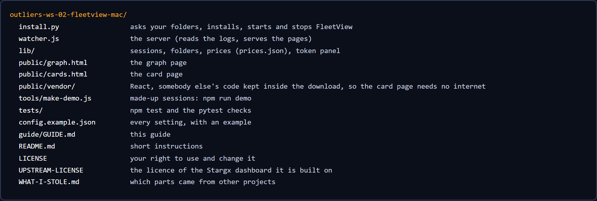

FleetView is built on Stargx/claude-code-dashboard (MIT licence, Copyright (c) 2025 Cold Beam Games), uses ccusage (MIT licence) for the 5-hour and 7-day gauges, and carries React 18.3.1 (MIT licence) for the card page. Prices were checked on 2026-09-22.
